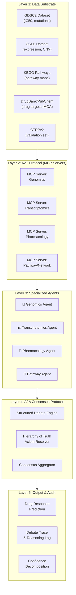
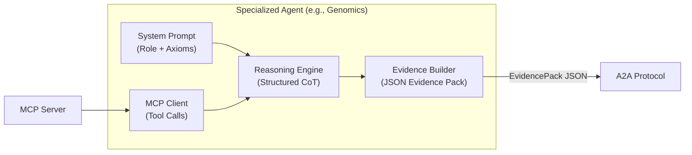
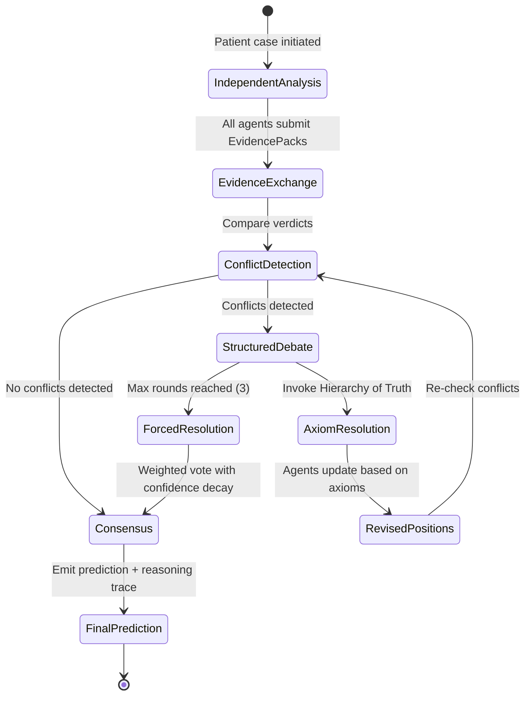

# Decentralized Multi-Agent Consensus Framework for Cancer Drug Resistance Prediction

## Comprehensive Technical Architecture & Implementation Plan

---

## 1. Critical Review of the Current Proposal

Your short proposal lays out a compelling vision. Here is an honest assessment of its **strengths** and the **gaps** that need addressing before implementation.

### ✅ Strengths
- **Clear problem framing**: The "Context Overwhelm" critique of monolithic LLMs is well-articulated and backed by recent literature
- **Novel protocol layering**: Separating A2T (Agent-to-Tool) from A2A (Agent-to-Agent) is architecturally clean and maps well to the MCP ecosystem
- **Clinically grounded metaphor**: Framing the system as a virtual tumor board gives the work immediate translational relevance
- **Anti-sycophancy design**: Explicitly targeting silent agreement and problem drift distinguishes this from naive multi-agent setups

### ⚠️ Gaps and Risks to Address

> [!WARNING]
> **The "Hierarchy of Truth" is underspecified.** The proposal mentions biological axioms (e.g., Central Dogma) but doesn't formalize how axioms are encoded, ranked, or invoked during debate. Without this, the protocol collapses into the same ad-hoc LLM reasoning you're critiquing.

> [!WARNING]
> **Evaluation strategy is thin.** "Benchmarking against CTRPv2" and "qualitative analysis of debate traces" is not sufficient for a thesis. You need quantitative metrics for both prediction accuracy AND reasoning quality, plus proper ablation studies.

> [!IMPORTANT]
> **No baseline comparisons defined.** You need to compare against: (1) a monolithic LLM given all data, (2) a naive multi-agent majority-vote system, (3) existing CDR models (e.g., DRN-CDR), and (4) single-agent per-modality predictions without debate.

> [!IMPORTANT]
> **The 4 agents are not well justified.** Why Genomics, Expression, Pharmacology, and Pathways? This particular decomposition needs biological grounding. For example: where does epigenomics fit? Where does copy number variation live? Is "Pathways" a data modality or an integration layer?

> [!NOTE]
> **MCP usage is promising but needs grounding.** The proposal correctly identifies MCP as the A2T layer, but doesn't specify MCP server implementations, tool schemas, or how structured data returns prevent the very "uncurated text" problem you're avoiding.

---

## 2. Refined Technical Architecture

### 2.1 Five-Layer Architecture

The system should be organized into 5 distinct layers, each with clear responsibilities:



### 2.2 Agent Decomposition — Refined and Justified

The proposal's 4 agents are a reasonable starting point, but the decomposition must be **modality-aligned**, not function-aligned. Here is a refined mapping:

| Agent | Biological Modality | Data Sources | Core Responsibility | Example Outputs |
|-------|-------------------|-------------|---------------------|----------------|
| **🧬 Genomics Agent** | DNA-level alterations | GDSC mutations, CCLE CNV, cosmic census | Assess whether a drug target is structurally intact or disrupted at the DNA level | `"BRAF V600E detected → target present for Vemurafenib"` |
| **📊 Transcriptomics Agent** | RNA expression | CCLE RNAseq (z-scores), GDSC expression | Determine whether the target/pathway is transcriptionally active or silenced | `"BRAF mRNA z-score = -2.1 → target underexpressed despite mutation"` |
| **💊 Pharmacology Agent** | Drug response data | GDSC2 IC50, drug MOA, target annotations | Provide historical dose-response context and drug mechanism knowledge | `"Historical IC50 for Vemurafenib in BRAF-mutant lines: median 0.3µM"` |
| **🔗 Pathway Agent** | Pathway topology | KEGG, Reactome pathways | Assess pathway-level bypass, redundancy, and downstream effects | `"MAPK pathway has ERK bypass via MEK2 → resistance mechanism plausible"` |

> [!TIP]
> **Why this decomposition works**: Each agent maps to a distinct *level of biological organization* (DNA → RNA → Drug interaction → Network topology). This mirrors the Central Dogma and creates natural points of conflict (e.g., mutation present but gene silenced) that the debate protocol must resolve.

### 2.3 Agent Internal Architecture

Each agent should follow a consistent internal structure:



**Each agent produces a structured `EvidencePack`:**

```json
{
  "agent_id": "genomics_agent",
  "cell_line": "A375",
  "drug": "Vemurafenib",
  "verdict": "SENSITIVE",
  "confidence": 0.85,
  "evidence_tier": "T1_STRUCTURAL",
  "key_findings": [
    {
      "biomarker": "BRAF_V600E",
      "value": "mutant",
      "interpretation": "Oncogenic driver mutation present; drug target is structurally active",
      "data_source": "GDSC_mutations",
      "axiom_invoked": "CENTRAL_DOGMA_DNA_PRIMACY"
    }
  ],
  "caveats": ["CNV data shows no amplification — single allele mutation"],
  "conflict_flags": []
}
```

---

## 3. The A2T Protocol — MCP Server Specifications

### 3.1 MCP Server Design

Each MCP server wraps a local dataset and exposes typed, schema-validated tools. This is what makes the system *deterministic* rather than linguistic.

#### Genomics MCP Server — Tools

| Tool Name | Parameters | Returns | Description |
|-----------|-----------|---------|-------------|
| `get_mutations` | `cell_line: str, gene: str?` | `[{gene, mutation, type, cosmic_id}]` | Fetch known mutations for a cell line |
| `get_cnv` | `cell_line: str, gene: str?` | `[{gene, cnv_value, status}]` | Copy number variation data |
| `check_mutation_impact` | `gene: str, mutation: str` | `{is_driver, is_actionable, drugs_targeting}` | Cross-reference mutation with known actionability |

#### Transcriptomics MCP Server — Tools

| Tool Name | Parameters | Returns | Description |
|-----------|-----------|---------|-------------|
| `get_expression` | `cell_line: str, gene: str?` | `[{gene, z_score, tpm, percentile}]` | Gene expression levels |
| `get_pathway_expression` | `cell_line: str, pathway_id: str` | `{pathway_genes: [{gene, z_score}], mean_z}` | Aggregate expression for a pathway |
| `check_silencing` | `cell_line: str, gene: str` | `{is_silenced: bool, z_score, threshold_used}` | Determine if a gene is transcriptionally silenced |

#### Pharmacology MCP Server — Tools

| Tool Name | Parameters | Returns | Description |
|-----------|-----------|---------|-------------|
| `get_ic50` | `cell_line: str, drug: str` | `{ic50, ln_ic50, z_score, auc}` | Historical drug response |
| `get_drug_info` | `drug: str` | `{target_genes, moa, pathway, drug_class}` | Drug mechanism of action |
| `get_sensitivity_profile` | `drug: str, mutation: str?` | `{median_ic50, resistant_fraction, n_cell_lines}` | Population-level sensitivity stats |

#### Pathway MCP Server — Tools

| Tool Name | Parameters | Returns | Description |
|-----------|-----------|---------|-------------|
| `get_pathway_genes` | `pathway_id: str` | `[{gene, role, position}]` | Genes in a pathway |
| `check_bypass` | `pathway_id: str, blocked_gene: str` | `{bypass_exists: bool, bypass_genes: [...]}` | Check for pathway redundancy |
| `get_upstream_regulators` | `gene: str` | `[{regulator, relationship, pathway}]` | Upstream regulatory context |

### 3.2 Data Preparation Strategy

> [!IMPORTANT]
> **All data must be pre-processed into clean, queryable formats before building MCP servers.** This is your first implementation milestone.

| Dataset | Source | Format | Pre-processing Required |
|---------|--------|--------|------------------------|
| **GDSC2** | [Sanger GDSC](https://www.cancerrxgene.org/) | CSV → SQLite | Filter to target drugs/cell lines, normalize IC50 values, link drug→target mappings |
| **CCLE** | [DepMap Portal](https://depmap.org/) | CSV → SQLite | RNAseq TPM → z-scores per gene, CNV segmentation → gene-level calls |
| **KEGG** | [KEGG REST API](https://rest.kegg.jp/) | KGML → JSON | Parse pathway XML into gene-interaction graphs, pre-compute bypass routes |
| **DrugBank** | DrugBank open data | XML → JSON | Extract drug→target→pathway mappings |
| **CTRPv2** | [CTD² Portal](https://ocg.cancer.gov/programs/ctd2) | CSV → SQLite | Held-out validation set; process AUC values into sensitive/resistant labels |

---

## 4. The A2A Consensus Protocol — Formalized

This is the intellectual core of your thesis and needs rigorous specification.

### 4.1 Debate Protocol State Machine



### 4.2 The Hierarchy of Truth — Formalized as Axiom Rules

This is where your proposal's key innovation lives. **The axioms must be explicit, testable, and encoded as logic rules**, not just prompts.

#### Axiom Tiers (Highest to Lowest Priority)

| Tier | Axiom Name | Rule | Example |
|------|-----------|------|---------|
| **T1** | Structural Primacy | If the drug target gene is deleted or has loss-of-function at DNA level, override all downstream signals | `IF cnv(EGFR) == "homozygous_deletion" THEN verdict = RESISTANT (override RNA/drug data)` |
| **T2** | Transcriptional Gate | If a gene is transcriptionally silenced (z-score < -2.0), its protein product is functionally absent regardless of DNA status | `IF z_score(BRAF) < -2.0 AND mutation(BRAF) == "V600E" THEN flag_conflict("mutation present but gene silenced")` |
| **T3** | Pathway Bypass | If the primary drug target pathway has a known bypass route that is active, resistance is likely even if the primary target is present | `IF bypass_exists(MAPK, blocked=BRAF) AND expression(bypass_genes) > 0 THEN escalate_resistance_risk()` |
| **T4** | Pharmacological Prior | Historical IC50 data provides a population-level prior but can be overridden by patient-specific molecular data (T1-T3) | `IC50 used as baseline; molecular evidence can shift prediction ±2 tiers` |
| **T5** | Statistical Consensus | When molecular evidence is ambiguous or absent, fall back to population-level statistics | `IF all_evidence_inconclusive THEN use median_ic50_based_prediction` |

#### Axiom Invocation Protocol

```json
{
  "axiom_challenge": {
    "challenger": "transcriptomics_agent",
    "target": "genomics_agent",
    "axiom": "T2_TRANSCRIPTIONAL_GATE",
    "argument": "BRAF V600E mutation is present, but BRAF mRNA z-score is -2.3. Under T2, the gene is effectively silenced. The mutation cannot confer drug sensitivity if the protein is not expressed.",
    "evidence": {
      "gene": "BRAF",
      "mutation_status": "V600E",
      "z_score": -2.3,
      "silencing_threshold": -2.0
    },
    "requested_action": "REVISE_VERDICT_TO_RESISTANT"
  }
}
```

### 4.3 Anti-Sycophancy Mechanisms

Your proposal correctly identifies sycophancy as a key flaw. Here are concrete mechanisms to prevent it:

1. **Blind Initial Analysis**: Agents produce their EvidencePacks *independently* before seeing any other agent's output
2. **Devil's Advocate Injection**: In each debate round, one agent is randomly assigned a "challenger" role requiring it to argue *against* the emerging consensus
3. **Confidence Decay**: If an agent changes its verdict, its confidence is penalized by 15% per flip — discouraging weathervaning
4. **Axiom-Locked Positions**: An agent can only change its verdict if presented with a higher-tier axiom challenge — it cannot simply "agree" without mechanistic justification
5. **Dissent Logging**: If an agent disagrees but is overridden by axiom hierarchy, the dissent is preserved in the final trace (mimicking minority opinions in real tumor boards)

---

## 5. Evaluation Framework — Comprehensive and Multi-Tier

> [!CAUTION]
> **This is where the current proposal is weakest.** A thesis requires rigorous, reproducible evaluation. Here is a multi-tier framework.

### 5.1 Tier 1: Predictive Accuracy (Quantitative)

**Task**: Binary classification — Sensitive vs. Resistant for each (cell_line, drug) pair.

| Metric | What It Measures | Target |
|--------|-----------------|--------|
| **AUROC** | Discrimination ability across thresholds | > 0.75 (competitive with CDR baselines) |
| **AUPRC** | Performance on imbalanced classes (resistance is rarer) | > 0.60 |
| **Accuracy** | Overall correctness | Report but don't optimize for |
| **Spearman ρ** | Rank correlation of predicted vs. actual IC50 | > 0.50 |
| **Cohen's κ** | Agreement beyond chance | > 0.40 |

**Dataset splits**:
- **Training/Development**: GDSC2 — use for agent prompt tuning and protocol calibration
- **Held-out Validation**: CTRPv2 — completely unseen during development
- **Cross-validation**: 5-fold stratified by cancer type on GDSC2

### 5.2 Tier 2: Reasoning Quality (Quantitative + Qualitative)

This is what differentiates your work from a black-box CDR model.

| Metric | How to Measure | Details |
|--------|---------------|---------|
| **Axiom Invocation Rate** | Count how often each axiom tier is triggered across all cases | Expect T1/T2 to fire in ~30-40% of cases |
| **Conflict Resolution Accuracy** | For cases where agents disagree: does resolving with axioms improve or degrade prediction? | Compare pre-debate vs. post-debate accuracy |
| **Debate Convergence** | Average number of rounds to reach consensus | Target: 1.5-2.5 rounds; >3 suggests protocol issues |
| **Biological Faithfulness Score** | Expert annotation of 50 randomly sampled debate traces: "Is the reasoning biologically valid?" | Use a Likert scale (1-5), aim for mean > 3.5 |
| **Hallucination Rate** | Percentage of agent claims that cite data not present in their MCP returns | Target: < 5% |

### 5.3 Tier 3: Ablation Studies (What Matters?)

These ablations prove your architectural choices are necessary, not arbitrary:

| Ablation | What You Remove | Expected Effect |
|----------|----------------|-----------------|
| **No Debate** | Agents predict independently, final answer = majority vote | ↓ Accuracy on conflict cases; proves debate adds value |
| **No Axioms** | Agents debate freely without Hierarchy of Truth | ↑ Sycophancy; ↓ biological faithfulness |
| **Monolithic LLM** | Single GPT-4/Claude given ALL data in one prompt | ↓ Accuracy due to context overwhelm on complex cases |
| **No MCP (raw text)** | Agents receive data as natural language paragraphs instead of structured MCP returns | ↑ Hallucination rate; ↓ data citation accuracy |
| **Single Agent per Modality** | Each agent predicts alone without seeing other modalities | ↓ Overall accuracy; proves multi-modal integration adds value |
| **Random Axiom Order** | Scramble the axiom hierarchy | ↓ Biological faithfulness; proves hierarchy matters |

### 5.4 Tier 4: Case Studies (Qualitative Showcase)

Select 3-5 well-characterized cell line + drug combinations where the resistance mechanism is known:

| Case Study | Cell Line | Drug | Known Mechanism | What to Demonstrate |
|-----------|-----------|------|----------------|-------------------|
| BRAF-mutant melanoma | A375 | Vemurafenib | BRAF V600E → sensitive | System correctly identifies sensitivity via T1 axiom |
| EGFR bypass | HCC827 | Gefitinib | MET amplification bypass | Pathway agent catches bypass → resistance despite EGFR mutation |
| Expression silencing | MCF7 | Tamoxifen | ESR1 expression variation | Transcriptomics agent detects expression levels |
| Multi-drug resistance | K562 | Imatinib | BCR-ABL + MDR1 expression | Complex multi-modal reasoning required |

### 5.5 Tier 5: Comparative Baselines

| Baseline | Type | Purpose |
|----------|------|---------|
| **GPT-4 Monolithic** | Single LLM, all data in prompt | Prove multi-agent > monolithic |
| **Majority Vote MAS** | 4 agents, simple majority | Prove axiom-based debate > naive voting |
| **DRN-CDR** (from ref [8]) | Traditional DL model | Prove LLM-based reasoning is competitive |
| **Random Forest on GDSC features** | Classical ML baseline | Sanity check |
| **EvoMDT** (from ref [5]) | State-of-art multi-agent MDT | Closest competitor — compare on same data |

---

## 6. Technology Stack

| Component | Technology | Rationale |
|-----------|-----------|-----------|
| **LLM Backend** | GPT-4o / Claude 3.5 Sonnet (via API) | Strong reasoning; tool-use capable |
| **MCP Servers** | Python + `mcp` SDK (FastMCP) | First-class MCP support; simple server setup |
| **Data Storage** | SQLite per dataset | Lightweight, portable, no server needed |
| **Agent Orchestration** | Python asyncio + custom orchestrator | Full control over debate protocol; no framework lock-in |
| **Debate Protocol** | Custom JSON message bus | Structured, logged, reproducible |
| **Evaluation** | scikit-learn + custom metrics | Standard ML evaluation + custom reasoning metrics |
| **Visualization** | Matplotlib + Plotly | Publication-quality figures |
| **Version Control** | Git | Reproducibility |

> [!TIP]
> **Avoid heavy frameworks like LangChain/AutoGen.** For a thesis, you want full control over the debate protocol — it IS your contribution. Using a framework would obscure your novel architecture.

---

## 7. Project Structure

```
thesis-framework/
├── README.md
├── pyproject.toml
├── data/
│   ├── raw/                    # Original downloaded datasets
│   │   ├── gdsc2/
│   │   ├── ccle/
│   │   ├── kegg/
│   │   └── ctpv2/
│   ├── processed/              # Cleaned, SQLite databases
│   │   ├── genomics.db
│   │   ├── transcriptomics.db
│   │   ├── pharmacology.db
│   │   └── pathways.db
│   └── test_cases/             # Curated case studies
│       └── case_studies.json
├── src/
│   ├── mcp_servers/            # Layer 2: A2T Protocol
│   │   ├── genomics_server.py
│   │   ├── transcriptomics_server.py
│   │   ├── pharmacology_server.py
│   │   └── pathway_server.py
│   ├── agents/                 # Layer 3: Specialized Agents
│   │   ├── base_agent.py       # Abstract agent class
│   │   ├── genomics_agent.py
│   │   ├── transcriptomics_agent.py
│   │   ├── pharmacology_agent.py
│   │   └── pathway_agent.py
│   ├── protocols/              # Layer 4: A2A Consensus
│   │   ├── debate_engine.py    # Orchestrates debate rounds
│   │   ├── axiom_resolver.py   # Hierarchy of Truth logic
│   │   ├── conflict_detector.py
│   │   └── consensus.py        # Final aggregation
│   ├── schemas/                # Shared data contracts
│   │   ├── evidence_pack.py    # Pydantic models
│   │   ├── debate_message.py
│   │   └── axiom_rules.py
│   └── evaluation/             # Layer 5: Evaluation
│       ├── metrics.py          # AUROC, AUPRC, etc.
│       ├── ablation_runner.py
│       ├── reasoning_scorer.py
│       └── visualize.py
├── experiments/
│   ├── configs/                # Experiment configurations
│   ├── results/                # Raw results
│   └── figures/                # Generated plots
├── tests/
│   ├── test_mcp_servers.py
│   ├── test_agents.py
│   ├── test_debate_protocol.py
│   └── test_axiom_resolver.py
└── notebooks/
    ├── data_exploration.ipynb
    ├── results_analysis.ipynb
    └── case_study_walkthrough.ipynb
```

---

## 8. Phased Implementation Roadmap

### Phase 1: Data Foundation (Weeks 1-2)

- [ ] Download and audit GDSC2, CCLE, KEGG, CTRPv2 datasets
- [ ] Design SQLite schemas for each modality
- [ ] Build ETL pipelines: CSV/XML → cleaned SQLite databases
- [ ] Define the cell line + drug pairs to use (select ~50-100 well-characterized pairs)
- [ ] Create the held-out validation split (CTRPv2)
- [ ] Write data validation tests

### Phase 2: MCP Servers (Weeks 2-3)

- [ ] Implement `genomics_server.py` with mutation/CNV tools
- [ ] Implement `transcriptomics_server.py` with expression/silencing tools
- [ ] Implement `pharmacology_server.py` with IC50/drug-info tools
- [ ] Implement `pathway_server.py` with pathway/bypass tools
- [ ] Write integration tests for each MCP server
- [ ] Validate that MCP returns match expected data for known cell lines

### Phase 3: Agent Design (Weeks 3-4)

- [ ] Design `BaseAgent` abstract class with common interface
- [ ] Implement system prompts with modality-specific axioms for each agent
- [ ] Implement MCP client integration (agent → tool calls)
- [ ] Implement `EvidencePack` structured output parsing
- [ ] Test each agent independently on 10 known cases
- [ ] Tune system prompts for output format compliance

### Phase 4: A2A Consensus Protocol (Weeks 4-6)

- [ ] Implement the debate state machine
- [ ] Build the `ConflictDetector` (compare verdicts across agents)
- [ ] Implement `AxiomResolver` with the 5-tier Hierarchy of Truth
- [ ] Build anti-sycophancy mechanisms (blind analysis, confidence decay, devil's advocate)
- [ ] Implement `ConsensusAggregator` for final prediction
- [ ] Build comprehensive debate trace logging
- [ ] Test on 20 cases with known outcomes

### Phase 5: Evaluation Pipeline (Weeks 6-8)

- [ ] Implement full evaluation metrics (AUROC, AUPRC, Spearman ρ, Cohen's κ)
- [ ] Run full framework on GDSC2 development set
- [ ] Run on CTRPv2 held-out validation set
- [ ] Implement and run all 6 ablation studies
- [ ] Run baseline comparisons (monolithic LLM, majority vote, classical ML)
- [ ] Conduct case study deep-dives (3-5 characterized examples)
- [ ] Generate publication-quality figures

### Phase 6: Analysis & Writing (Weeks 8-10)

- [ ] Analyze debate traces for biological faithfulness
- [ ] Compute hallucination rates
- [ ] Write results chapter with quantitative + qualitative findings
- [ ] Prepare case study narratives with debate trace visualizations
- [ ] Draft discussion of limitations and future work

---

## 9. Open Questions for Your Decision

> [!IMPORTANT]
> ### Q1: LLM Selection
> Which LLM(s) do you plan to use? Options:
> - **GPT-4o** (OpenAI API) — strong reasoning, good tool use
> - **Claude 3.5 Sonnet** (Anthropic) — excellent for structured output
> - **Open-source (Llama 3, Mixtral)** — reproducible but weaker reasoning
> - **Multiple LLMs** — test with 2+ to show framework is LLM-agnostic
>
> Recommendation: Start with GPT-4o for development, then show LLM-agnosticism by also testing with Claude.

> [!IMPORTANT]
> ### Q2: Scale of Evaluation
> How many (cell_line, drug) pairs do you plan to evaluate?
> - **Small (30-50)**: Faster iteration, but statistically weaker
> - **Medium (100-200)**: Good balance for a thesis
> - **Large (500+)**: Expensive (LLM API costs), but more publishable
>
> Recommendation: ~100-150 pairs from GDSC2, ~50 from CTRPv2 for validation.

> [!IMPORTANT]
> ### Q3: Epigenomics Agent
> Your proposal mentions epigenomics in the problem statement but doesn't include a dedicated epigenomics agent. Options:
> - **Add a 5th Methylation Agent** using CCLE methylation data
> - **Fold methylation into the Transcriptomics Agent** as a silencing indicator
> - **Defer to future work** and note it as a limitation
>
> Recommendation: Fold into Transcriptomics for this study; note a dedicated agent as future work.

> [!IMPORTANT]
> ### Q4: Timeline
> What is your thesis submission deadline? The roadmap above assumes ~10 weeks. If your timeline is different, I'll adjust phase allocations.

> [!IMPORTANT]
> ### Q5: Budget
> LLM API calls for 100+ cases × 4 agents × multiple debate rounds can add up. Do you have an API budget in mind, or should we design for cost-efficiency (e.g., using cheaper models for initial rounds)?

---

## 10. Risk Mitigation

| Risk | Likelihood | Impact | Mitigation |
|------|-----------|--------|-----------|
| LLM hallucinations despite MCP | Medium | High | MCP returns are structured JSON; agents must cite specific data fields; hallucination detection in eval |
| Debate doesn't converge | Low | Medium | Max round limit (3); forced resolution via weighted confidence |
| API costs exceed budget | Medium | Medium | Cache LLM responses; batch similar queries; use cheaper models for ablations |
| Axiom hierarchy too rigid | Medium | Medium | Allow "soft overrides" with justification; tune thresholds on dev set |
| CTRPv2 cell lines don't overlap with GDSC2 | Low | High | Check overlap early in Phase 1; fall back to GDSC2 cross-validation if insufficient |
| Agents produce inconsistent output formats | Medium | Medium | Pydantic schema validation; retry with format correction prompt |

---

## Summary

This plan transforms your proposal from a strong concept into an implementable, evaluable thesis. The key refinements are:

1. **Formalized Hierarchy of Truth** with 5 explicit axiom tiers and invocation protocol
2. **Multi-tier evaluation** covering accuracy, reasoning quality, ablations, case studies, and baselines
3. **Concrete MCP server specs** with typed tool schemas
4. **Anti-sycophancy mechanisms** beyond what the literature offers
5. **Clear ablation studies** that prove each architectural choice is necessary

Please review the open questions above and let me know your decisions — I'll refine the plan accordingly.
