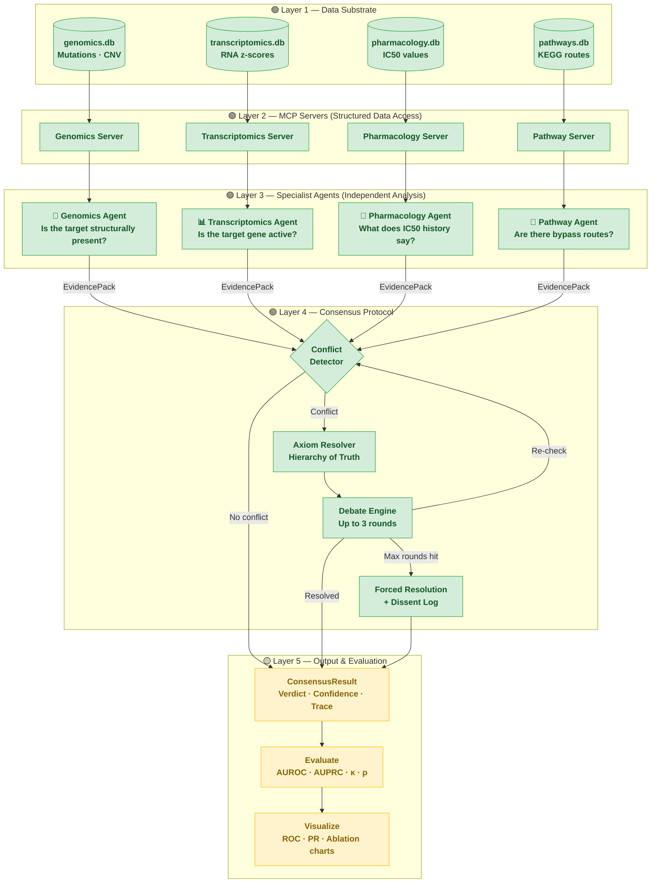
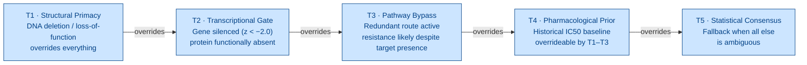

# Decentralized Multi-Agent System for Cancer Drug Resistance Prediction
## Progress Summary — June 2026

---

## What the System Does

This project builds a software framework that predicts whether a cancer cell line will be **sensitive or resistant** to a given drug. Rather than asking a single AI model to reason over all available biological data at once — which tends to produce shallow, overconfident answers — the framework splits the problem across four specialised AI agents, each responsible for a distinct type of biological evidence. The agents then debate their conclusions under a formal set of rules before converging on a consensus prediction.

The core thesis claim is that this structured, rule-governed multi-agent approach produces more reliable and biologically faithful predictions than a single large language model (LLM) given the same data.

---

## System Flow & Implementation Status

> **Key:** 🟢 Implemented & tested — 🟡 Infrastructure ready, pending live LLM run



---

## Debate Protocol — Detail

This diagram zooms into Layer 4. Everything shown here is fully implemented.

```mermaid
stateDiagram-v2
    direction LR
    [*] --> IndependentAnalysis : Case initiated

    IndependentAnalysis : 🟢 Independent Analysis\n4 agents run concurrently\n(cannot see each other's output)
    EvidenceExchange : 🟢 Evidence Exchange\nAll 4 EvidencePacks submitted
    ConflictCheck : 🟢 Conflict Detection\nMajority verdict computed
    Consensus : 🟢 Consensus\nAll agents agree
    Debate : 🟢 Structured Debate Round\nAxiom Resolver picks winner\nLoser confidence −15%\nLoser verdict overridden
    Recheck : 🟢 Re-check Conflicts
    Forced : 🟢 Forced Resolution\nHighest-tier agent wins\nDissent recorded in trace
    Output : 🟡 Final Prediction\nVerdict · Confidence · Trace\n→ evaluate() → visualize()

    IndependentAnalysis --> EvidenceExchange
    EvidenceExchange --> ConflictCheck
    ConflictCheck --> Consensus : No conflict
    ConflictCheck --> Debate : Conflict detected
    Debate --> Recheck
    Recheck --> Consensus : Resolved
    Recheck --> Debate : Still conflicting (round 2, 3)
    Debate --> Forced : Round 3 exhausted
    Consensus --> Output
    Forced --> Output
    Output --> [*]
```



---

## Axiom Hierarchy (Hierarchy of Truth)

When agents disagree, the resolver consults this ranked table. Higher tier always wins.



---

## System Architecture — Five Layers

### Layer 1 — Data Substrate
Four biological datasets have been downloaded, cleaned, and loaded into local SQLite databases:

| Database | Contents | Used For |
|---|---|---|
| `genomics.db` | Somatic mutations, copy number variation | DNA-level evidence |
| `transcriptomics.db` | RNA expression z-scores | Gene activity evidence |
| `pharmacology.db` | Historical IC50 drug response values | Drug sensitivity priors |
| `pathways.db` | KEGG pathway gene membership | Pathway bypass evidence |

A curated evaluation dataset of **40 (cell line, drug) pairs** with known sensitivity labels has been defined in `data/cases.yaml`.

#### Data Sources

| Source | Provider | What We Use |
|---|---|---|
| **GDSC2** — Genomics of Drug Sensitivity in Cancer | Sanger Institute / cancerrxgene.org | IC50 drug response values, drug targets, pathway annotations. Primary source for the 40 evaluation cases — labels assigned by z-score threshold (z < −0.5 → Sensitive, z > 0.5 → Resistant). |
| **CCLE / DepMap** — Cancer Cell Line Encyclopedia | Broad Institute / depmap.org | Somatic mutations (e.g. BRAF V600E), copy number variation, and RNA expression levels across ~1,800 cancer cell lines. |
| **KEGG** — Kyoto Encyclopedia of Genes and Genomes | EMBL / rest.kegg.jp | Signalling pathway gene membership, fetched via REST API. Supplemented with curated bypass routes (e.g. MEK2 bypasses BRAF in the MAPK pathway). |
| **ChEMBL** | EMBL-EBI / ebi.ac.uk/chembl | Drug mechanism of action and drug class (e.g. "BRAF inhibitor"), fetched via API during data loading. |

GDSC2 and DepMap/CCLE are the two primary benchmarking databases used across the cancer drug resistance literature, which makes the evaluation directly comparable to published baselines.

---

### Layer 2 — Structured Data Access (MCP Servers)
Each database is wrapped in a lightweight server that exposes typed, schema-validated query tools. This is the mechanism that prevents agents from hallucinating data — every factual claim an agent makes must come back through one of these tools as structured JSON, not free text.

Four servers are implemented:
- **Genomics server** — queries mutations and copy number variation for a given cell line
- **Transcriptomics server** — queries gene expression levels, flags silenced genes
- **Pharmacology server** — retrieves historical IC50 values and drug mechanism of action
- **Pathway server** — checks whether bypass routes exist in a signalling pathway

---

### Layer 3 — Specialist Agents
Four agents are implemented, each wrapping one MCP server and one LLM:

| Agent | Biological Focus | Key Question It Answers |
|---|---|---|
| **Genomics Agent** | DNA mutations, copy number | Is the drug target structurally present or disrupted? |
| **Transcriptomics Agent** | RNA expression | Is the target gene actually active, or transcriptionally silenced? |
| **Pharmacology Agent** | Drug response history | What does population-level IC50 data suggest? |
| **Pathway Agent** | Signalling network topology | Are there bypass routes that would confer resistance? |

Each agent reasons independently — it cannot see what the other agents have concluded — and produces a structured **EvidencePack**: a verdict (Sensitive / Resistant / Uncertain), a confidence score, the tier of evidence invoked, and the specific findings that support the verdict.

---

### Layer 4 — Consensus Protocol (the Novel Contribution)
This is the intellectual core of the thesis. Three components work together:

**Conflict Detector** — after all four agents submit their EvidencePacks, this component checks whether agents disagree. If all agree, the result is accepted immediately with no debate.

**Axiom Resolver** — if there is a conflict, this component applies the *Hierarchy of Truth*: a ranked set of five biological axioms that determine which agent's evidence takes precedence. For example:
- A structural DNA deletion (T1) overrides RNA expression data (T2)
- Transcriptional silencing (T2) overrides historical drug response priors (T4)
- Pathway bypass evidence (T3) escalates resistance risk even when the primary target is present

Agents that are overridden have their confidence penalised by 15% per position change, discouraging sycophantic agreement.

**Debate Engine** — orchestrates up to three rounds of conflict detection and axiom-based resolution. If consensus is not reached after three rounds, a forced resolution is applied and the dissenting agents are recorded. The full debate trace — every round, every axiom invoked, every verdict change — is preserved for analysis.

---

### Layer 5 — Evaluation Pipeline
A complete evaluation pipeline has been implemented:

| Module | What It Computes |
|---|---|
| `metrics.py` | AUROC, AUPRC, Spearman ρ, Cohen's κ for any set of predictions |
| `ablation_runner.py` | Three variant engines: no-debate (majority vote), no-axioms (confidence only), random axiom order |
| `baselines.py` | Random Forest classifier trained on GDSC features as a classical ML baseline |
| `model_comparison.py` | Runs the full framework with multiple LLMs and collects per-model metrics |
| `visualize.py` | ROC curves, PR curves, ablation bar charts, debate convergence histograms, axiom frequency plots |

---

## Multi-Model Comparison

The LLM client has been extended to support four free model providers through a unified interface. The same framework code runs identically regardless of which model is used — only a prefix in the model name changes:

| Label | Model | Provider |
|---|---|---|
| `gemini-flash` | Gemini 1.5 Flash | Google AI Studio |
| `qwen-32b` | Qwen QwQ 32B | Groq |
| `gemma-9b` | Gemma 2 9B | Groq |
| `llama-70b` | Llama 3.3 70B | Groq |

All responses are cached in a local SQLite database, so re-running the evaluation after the first pass costs nothing in API calls.

A single command runs the full comparison across all four models:
```
python experiments/compare_models.py
```
This loads the 40 GDSC2 cases, runs each model, evaluates predictions, prints a metrics table, and saves a comparison figure.

---

## Test Coverage

The entire codebase is covered by **143 automated tests** across all components. Tests were written before implementation throughout (test-driven development), which means each test was first observed to fail before the corresponding code was written.

| Test File | What It Covers |
|---|---|
| `test_agents.py` | All four specialist agents |
| `test_protocols.py` | ConflictDetector, AxiomResolver |
| `test_debate_engine.py` | Full debate state machine, forced resolution, dissent logging |
| `test_orchestrator.py` | Concurrent agent fan-out, JSONL output |
| `test_llm.py` | LLM client routing, caching, multi-provider support |
| `test_metrics.py` | AUROC, AUPRC, Spearman ρ, Cohen's κ, edge cases |
| `test_ablation_runner.py` | All three ablation variant engines |
| `test_baselines.py` | Random Forest baseline |
| `test_model_comparison.py` | Multi-model runner, per-model evaluation |
| `test_visualize.py` | All five figure-generating functions |

---

## Current Status

**Complete (software):**
- Data ETL pipelines and all four MCP servers
- All four specialist agents with system prompts
- Full debate protocol (ConflictDetector → AxiomResolver → DebateEngine → Orchestrator)
- Complete evaluation pipeline (metrics, ablations, baselines, visualizations)
- Multi-model support for four free LLM providers

**Pending (requires running with live LLMs):**
- Full framework run on 40 GDSC2 development cases
- Held-out validation on CTRPv2
- Case study deep-dives (3–5 well-characterised cell line / drug pairs)
- Baseline and ablation results tables
- Figures for the thesis results chapter

The next step is to obtain free API keys for Groq and Google AI Studio, then run `experiments/compare_models.py` to produce the first set of real predictions.
